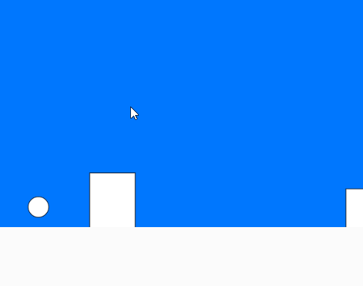
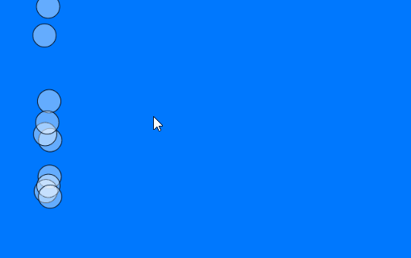
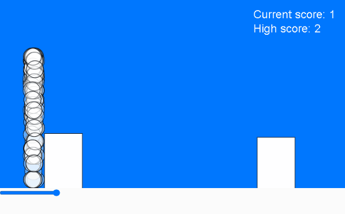
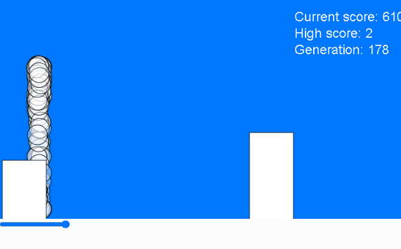

# Pangolin runner
### (Dino runner clone)

Genetic Algorithm implementation in Javascript library p5.
Inspired by the Toy neural network library given by Dan Shiffman and his implementation of genetaic algorithm on a flappy bird clone. Check it out here: https://www.youtube.com/watch?v=cdUNkwXx-I4&t=446s 

It all started at first buggy implementation,

But after some experimentation got the hit detection right.
Now to consider what are the parameters that needs to be takena s input to neural network.

I chose primitively:
1. pango.x - pipes[i].x
2. pipes[i].y maybe

After I got it to work, its brain was giving output as NaN and the pangolin never jumped.

Okay so there was a bug with the brain now its working however its not learning !

Suddenly in generation 178, this happens :

What a lovely freak of nature.

Never mind it was a bug all along :C

live at : https://editor.p5js.org/fanbyprinciple/full/QEWUkKawt