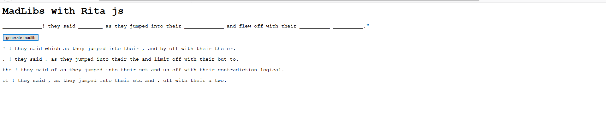

# Attempt at generating madlibs using Rita.js

Surprisingly stark documentation on word generation using rita

A work in progress true.

# Reference resources for Rita.js

### POS tags
https://rednoise.org/rita/reference/PennTags.html  

### More Tutorials
https://rednoise.org/rita/tutorial/analyzing.php#POS 

### ever reliable shiffman
https://www.youtube.com/watch?v=VaAoIaZ3YKs

### rita.js minified
https://cdnjs.cloudflare.com/ajax/libs/tabletop.js/1.5.1/tabletop.min.js

### instructive examples
https://rednoise.org/rita/examples.php

### good tutorial by Allison Parrish
https://creative-coding.decontextualize.com/intro-to-ritajs/