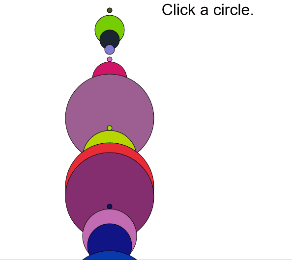

# Word counter

Adaptation of shiffmans 5.1 programming with text - word counter -
https://www.youtube.com/watch?v=unm0BLor8aE

The main corpus is generated but there seems to be a bug in visualisation.

The dominant word( with most count value) seems to throw the distance function to a tiff. 

Use with caution.
