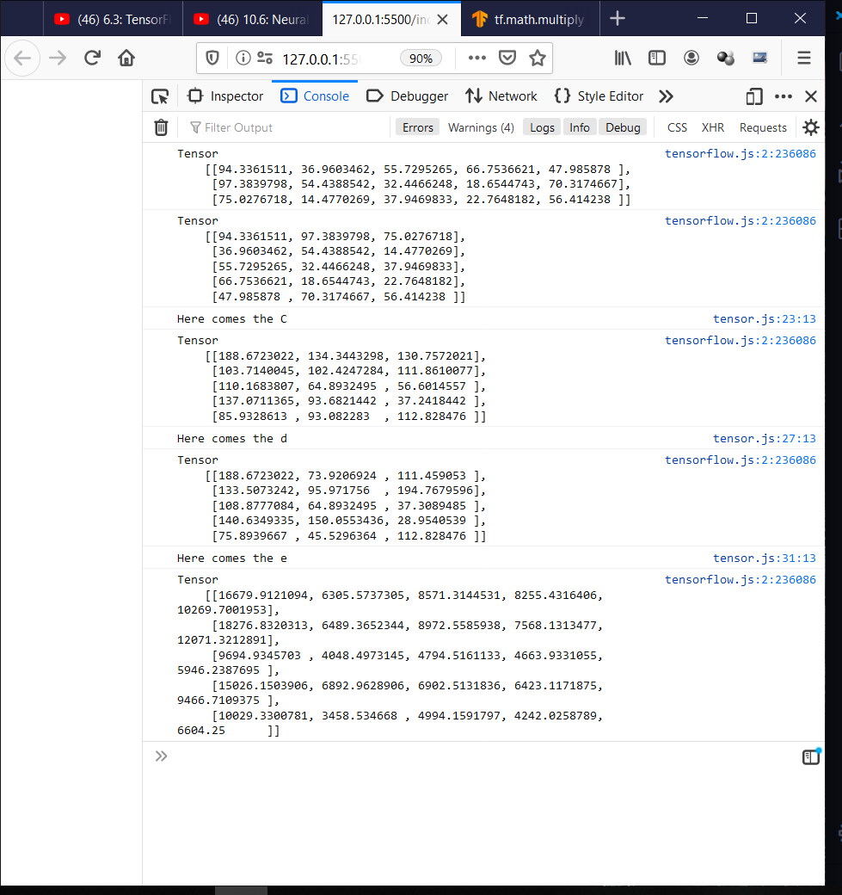
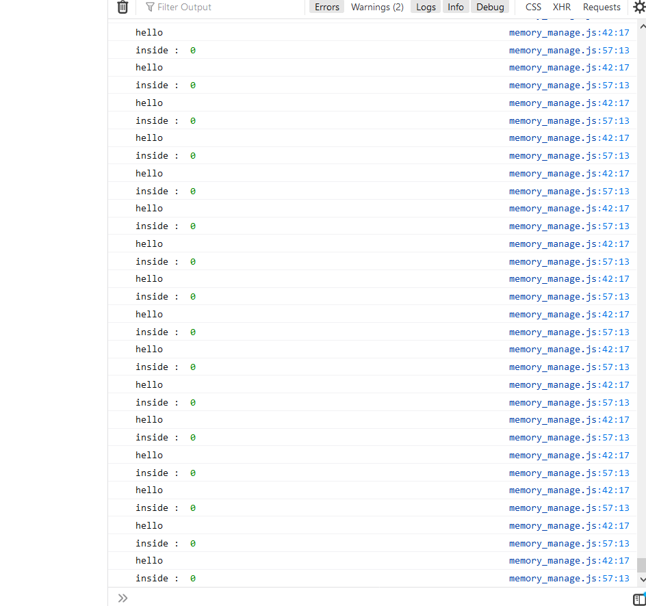
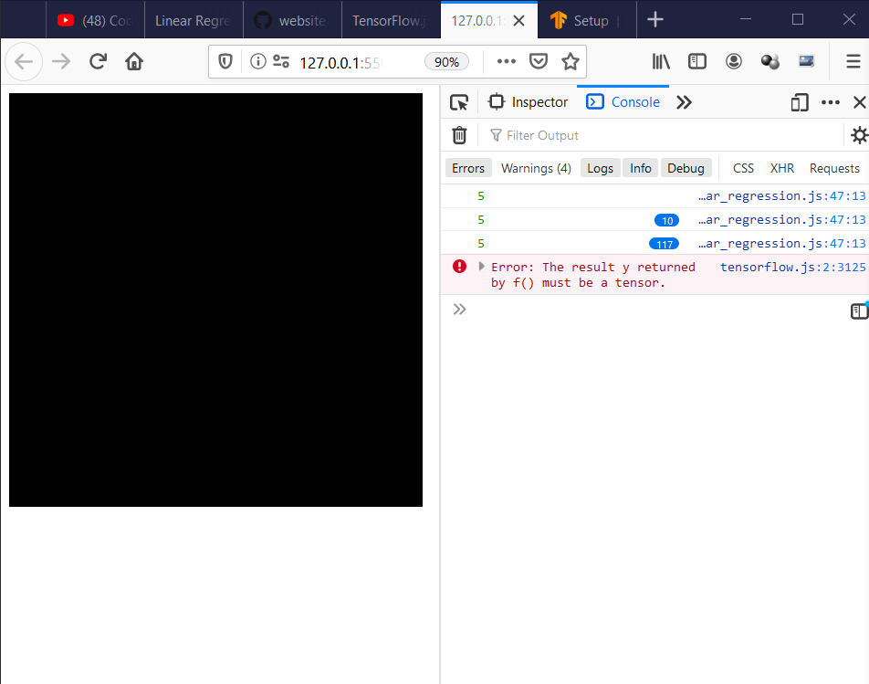
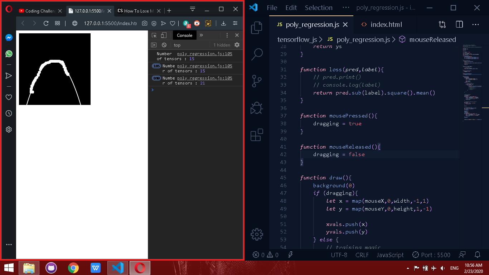

# Getting to know basics of tensorflow js

### variables and operations in tensorflow.js

### memory management in tensorflow.js

### linear regression with tensorflow
https://www.youtube.com/watch?v=dLp10CFIvxI&list=PLRqwX-V7Uu6YIeVA3dNxbR9PYj4wV31oQ&index=5

### quadratic regresssion with tensorflow.js

https://www.youtube.com/watch?v=tIXDik5SGsI&list=PLRqwX-V7Uu6YIeVA3dNxbR9PYj4wV31oQ&index=6

