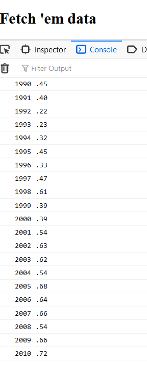
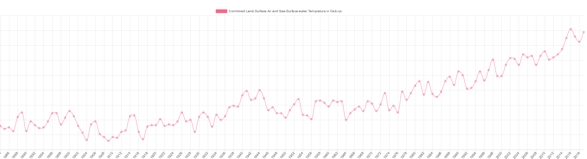

### Notes

1. getting csv file from : https://data.giss.nasa.gov/gistemp/

2. We can parse csv file using D3.js, p5.js
but we will do it using javascript split() function
in this exercise

slice function makes a copu of array from a particular index to a particular index.

3. Getting individual values from csv :

4. Chart.js for creating a chart
