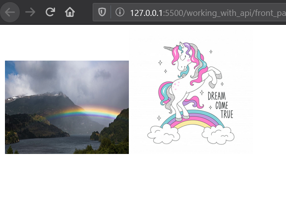

### get request with fetch

we call fetch function
which is synchronous and we get a response
through a promise
the response can be a json a blob or text data
grabbing data that is required from the data strean
and then make an image element out of the blob

Basically we take out image from the folder and insert it into html.

async - a keyword to denote a function is going to happen asynchronously
we use await as syntactic sugar to handle the response

Exercise solution:
